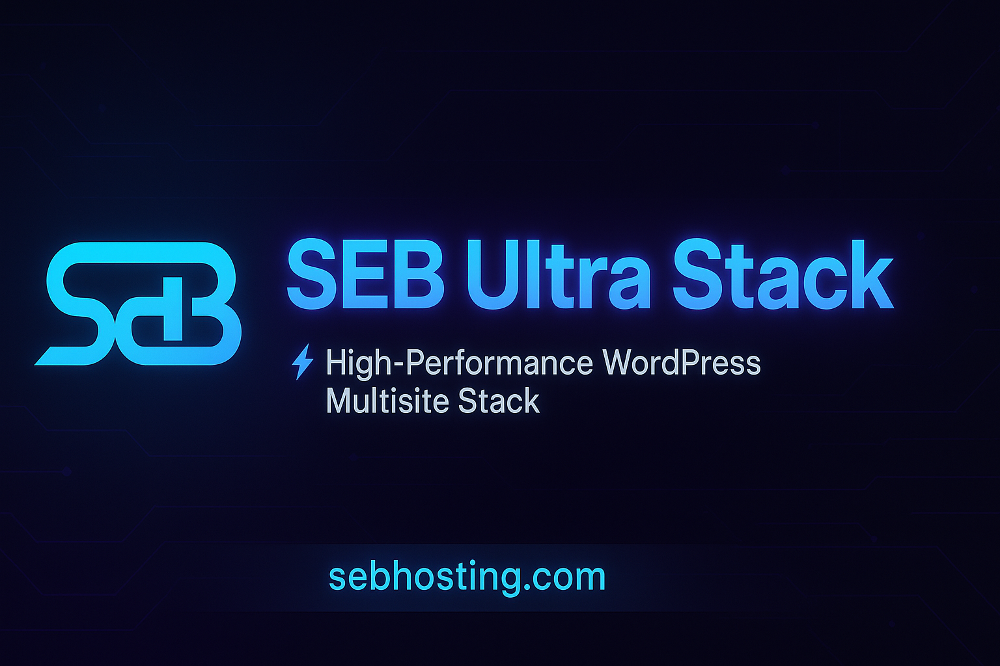

<p align="center">
  
</p>

# 🔥 SEB Ultra Stack — The ULTIMATE Production Repo

[](https://github.com/sebhosting/seb-ultra-stack/actions/workflows/ci.yml)
[](https://github.com/sebhosting/seb-ultra-stack/actions/workflows/docs.yml)
[](https://github.com/sebhosting/seb-ultra-stack/releases)
[](https://github.com/sebhosting/seb-ultra-stack/actions/workflows/codeql.yml)


---

## ⚡ Overview
**SEB Ultra Stack** is a **high‑performance WordPress Multisite (subdomains)** stack for Ubuntu 24.04 LTS with **Nginx + PHP 8.3 + MariaDB + Redis**, **Cloudflare/Let’s Encrypt SSL**, and **pro‑grade CI/CD**.  
Everything is automated and hardened — just run `./first-run.sh` or go **Docker** with `docker-compose`.

---

## 🚀 One‑Click Install (Bare Metal)
```bash
chmod +x first-run.sh
./first-run.sh
```
Installer prompts for domain/email/db password (+ optional Cloudflare + PayPal).

---

## 🐳 Dockerized Option
```bash
cp .env.example .env
# edit .env with passwords and domain
make up
make wp   # first-time WordPress init inside the shared volume
```
Then issue SSL:
```bash
make ssl-http            # HTTP-01
# or handle DNS-01 manually / run bare-metal for Cloudflare DNS-01
```

---

## 🛡️ Security & Performance
- TLS 1.2/1.3 + HSTS, strict security headers
- Fail2Ban + ufw firewall (bare-metal)
- Redis via UNIX socket/password (bare-metal) or container auth (Docker)
- `wp-config.php` hardening, file edit disabled, salts auto-generated

---

## 📚 Docs
Docs deploy to **https://docs.sebhosting.com** via GitHub Pages from `docs/`.

---

## 📝 Changelog & License
- See **CHANGELOG.md** (auto-updated by releases)
- License: **MIT**
