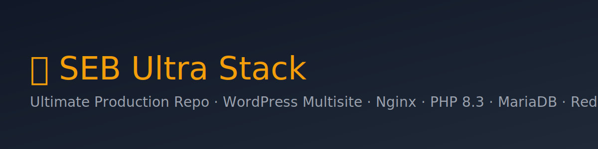

<p align="center">
  
</p>

<h1 align="center">🔥 SEB Ultra Stack — Ultimate Production Repo</h1>

<p align="center">
  <a href="https://github.com/sebhosting/seb-ultra-stack/actions/workflows/ci.yml"></a>
  <a href="https://github.com/sebhosting/seb-ultra-stack/actions/workflows/deploy.yml"></a>
  <a href="https://github.com/sebhosting/seb-ultra-stack/releases"></a>
  
  
  
  
  
  
  <a href="https://www.paypal.com/ncp/payment/Z5ZWDLX6BW9NQ"></a>
</p>

> ⚡ <strong>High-performance WordPress Multisite (subdomains)</strong> for Ubuntu 24.04 LTS — Nginx + PHP 8.3 + MariaDB + Redis + Cloudflare/Let's Encrypt, hardened and automated.  
> Use <strong>Bare-Metal</strong> installer or <strong>Docker</strong> — your choice.

---

## 🚀 One-Click Install (Bare-Metal)
```bash
chmod +x first-run.sh
./first-run.sh
```
- Prompts for <strong>domain, email, DB</strong>, optional <strong>Cloudflare</strong> (wildcard SSL) & <strong>PayPal API</strong> (client id/secret).  
- Installs WordPress, converts to Multisite (subdomains), pre-installs: WooCommerce, Jetpack, FluentSMTP, Redis Object Cache, Really Simple SSL.

## 🐳 Docker (Included)
```bash
cp .env.example .env
# edit .env
docker compose up -d --build
make wp
# (optional HTTP-01 cert) 
make ssl-http DOMAIN=example.com EMAIL=admin@example.com
```

## 🛡️ Security
- TLS 1.2/1.3, HSTS, strict headers
- Fail2Ban + UFW (bare-metal)
- Redis socket/password, `DISALLOW_FILE_EDIT`
- Secrets in `.env`, salts auto-generated

## 📚 Docs
- Auto-deployed to **https://docs.sebhosting.com** via GitHub Pages (workflow included).

## 🧩 CI/CD
- **CI**: ShellCheck
- **Release**: semantic-release → GitHub Release + CHANGELOG
- **Docs**: Actions → Pages + CNAME

## 🤝 Sponsor
Keep it blazing fast → <a href="https://www.paypal.com/ncp/payment/Z5ZWDLX6BW9NQ">PayPal</a>.
