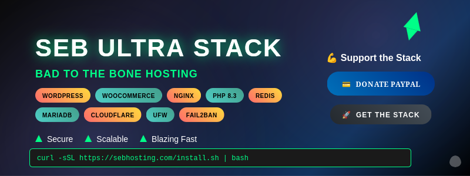

# SEB Ultra Stack 🚀 v1.3.9



⚡ The Ultimate WordPress Multisite + WooCommerce Stack — Nginx, PHP 8.3, Redis, MariaDB, Cloudflare SSL, UFW & Fail2Ban. Secure. Scalable. Blazing Fast! 

[](https://github.com/sebhosting/seb-ultra-stack/actions/workflows/ci.yml)
[](https://docs.sebhosting.com)
[](LICENSE)

---
### Features
- One-click install script (`install.sh`)
- GitHub Pages Docs (`docs/`)
- Banner + branding included
- Auto version bump + release workflows

---
### Install
```bash
curl -sSL https://sebhosting.com/install.sh | bash
```
💪 Support This Project
💳 Donate via PayPal • ⭐ Star this repo

📋 What's Included

WordPress Multisite - Manage multiple sites
WooCommerce - Complete e-commerce solution
High Performance - Nginx + PHP 8.3 + Redis caching
Security - UFW firewall + Fail2Ban protection
SSL - Cloudflare integration
Database - Optimized MariaDB setup

🛠️ Features

✅ One-click installation
✅ Auto-deployment workflows
✅ Comprehensive documentation
✅ Production-ready configuration
✅ Scalable architecture

Made with 💀 by SEB Hosting


